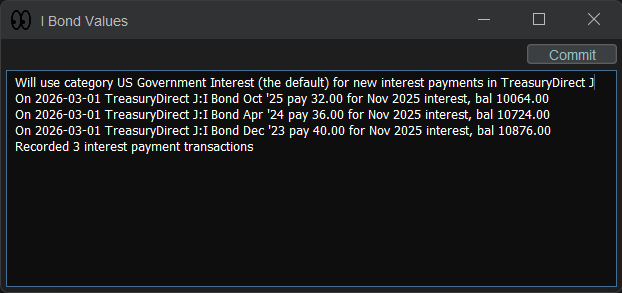

# I Bond Values Moneydance Extension

This extension pulls Series I savings bond interest rates from TreasuryDirect.gov and
creates artificial interest transactions in Moneydance so your holdings' current values
should reflect your available balances — without logging in to TreasuryDirect.

- Finds I bond securities in your Moneydance investment accounts
- Looks up interest rate history for your I bonds
- Creates corresponding artificial interest transactions
- Lets you see all changes before committing them in Moneydance
- This happens **without** logging in to TreasuryDirect



## Compatibility

- [Moneydance](https://moneydance.com) 2023.2 or later (extension is built for Java 21)

## Installation

1. Download the latest [release](https://github.com/jrhillery/ibondvals/releases/latest).

2. Follow [Moneydance's published documentation to install extensions](https://infinitekind.tenderapp.com/kb/extensions-2/installing-extensions).  
   Use the `Add From File...` option to load the `ibondvalues.mxt` file.

3. **The extension has not yet been audited and signed by The Infinite Kind**,
   so you'll get a warning asking you if you really want to continue loading
   the extension, click **Yes** to continue loading the extension.

4. You can now run the extension by going to **Extensions > I Bond Values**.

## Usage Details

If not already done, create one or more investment accounts to house your I bonds.
Each account can hold multiple I bonds.
A suggested approach is to have one account in Moneydance for each
account on TreasuryDirect.

### Default Category

This extension creates its artificial interest transactions with the
default category of the corresponding investment account.
So setting up the account default category to something like
`Investment Income:US Government Interest` works well.

### Ticker Symbol Naming Convention

This extension determines an I bond issue year and month by parsing its ticker symbol.
Here, a security with an I bond ticker symbol must start with 'IBond'
(in any case) followed by the year followed by a 2-digit month number
in the format IBondYYYYMM.
Examples: `IBond201901`, `IBOND202212`, `ibond202304`
All securities with ticker symbols of this form are processed as I bonds.

### Buy I Bonds

Create Moneydance securities transactions to record buying shares of these I bonds.
You can also record I bond sales.
This extension depends on the share price always being \$1 per share.
This is used when creating artificial interest transactions.
So use a share price of \$1 in your buy and sell Moneydance transactions.

### Run The I Bond Values Moneydance Extension

Use the Moneydance extension menu to run this extension.
This extension will examine your holdings and calculate any missing artificial interest transactions.
These are displayed for your review.
If you approve, select the `Commit` action to store the calculated transactions in Moneydance.
If everything is up to date, a message says it found no new interest payment data.

### How Artificial Interest Transactions Are Calculated

An overview of I bond interest is described on the TreasuryDirect
[website](https://treasurydirect.gov/savings-bonds/i-bonds/i-bonds-interest-rates).
This extension gets interest rates from the xlsx rate history chart linked on that web page.
This extension calculates interest following details the US Code of Federal Regulations (CFR)
[Title 31 Subtitle B Chapter II Subchapter A Part 359](https://www.ecfr.gov/current/title-31/subtitle-B/chapter-II/subchapter-A/part-359).
This involves stepping 6 months at a time.
For each semiannual period, the composite rate is calculated,
and monthly interest transactions are generated for that period.

Because I bond interest accrues monthly but compounds only semiannually,
a monthly growth multiplier is derived from the composite rate:
```math
\text{monthlyMultiplier} = \left(1 + \frac{\text{compositeRate}}{2}\right)^{1/6}
```

Interest is calculated base on a unit value (<span>$25</span> when issued).
For each of the 6 months, the unit value is stepped forward by this multiplier and rounded to the nearest cent.
The interest credited is:
```math
\text{interest} = (\text{unitVal}_m - \text{unitVal}_{m-1}) \times \text{eligibleUnits}
```
where *eligible units* reflects the portion of the balance still earning interest after any partial redemptions.

After each semiannual period, accrued interest (including interest
not yet available) is folded back into the balance eligible to earn interest.

The 3-month early-redemption penalty (applicable for bonds held fewer than 5 years)
is handled by deferring affected interest transactions.
The payable date for these transactions is shifted out 3 months (capped at the penalty expiry date).

#### Known Limitation

Since CFR 359 doesn't detail how partial redemptions are handled,
this extension handles partial redemptions in a manner that has not been validated.

## Troubleshooting

Raise issues or questions in this extension's GitHub [issues page](https://github.com/jrhillery/ibondvals/issues).
Please include a copy of the Moneydance console messages from `Help` > `Console Window`.

## Links

- 📦 [Releases](https://github.com/jrhillery/ibondvals/releases)
